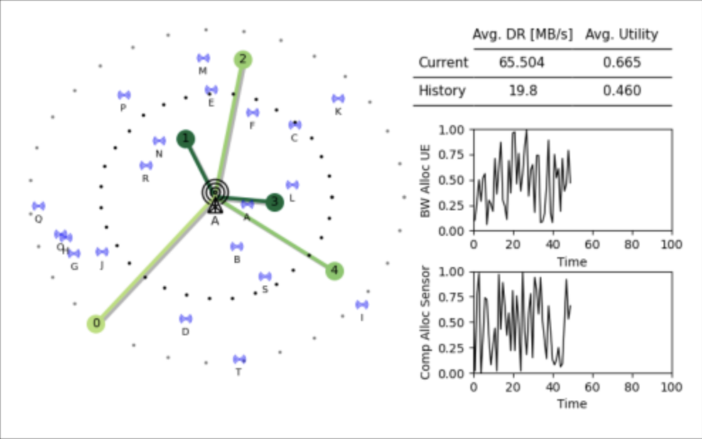

# MetaLore: Learning to Orchestrate the Metaverse


**MetaLore** is a simulation environment for exploring dynamic resource allocation in **smart city** and **metaverse**-inspired systems. It models the interaction between mobile users, sensors, base stations, and edge servers in a **sub-metaverse**, where efficient orchestration of limited communication and computational resources is critical for real-time synchronization between the physical and digital worlds.

Built upon the [`mobile-env`](https://github.com/stefanbschneider/mobile-env) framework, MetaLore extends its capabilities to support **deep reinforcement learning (DRL)**-based control and **Age of Information (AoI)**-aware optimization.

## Key Features

- **Joint Resource Allocation:**  
  Dynamically splits both communication bandwidth and computational resources between mobile user equipment (UEs) and stationary environmental sensors.

- **Custom AoI Metrics:**  
  Integrates novel delay-aware metrics:  
  - **AoRI** (Age of Request Information) — measures end-to-end service latency.  
  - **AoSI** (Age of Sensor Information) — captures data freshness from sensors.

- **Multi-Objective Optimization:**  
  Balances throughput, latency and synchronization accuracy through a DRL reward function.

- **DRL Integration:**  
  Fully compatible with **Gymnasium** and **Stable-Baselines3**, with native support for **Proximal Policy Optimization (PPO)**.

- **Visualizations & Evaluation Tools:**  
  Built-in tools for monitoring queue dynamics, AoI metrics and policy performance.

## Research Context

MetaLore was developed as part of an ongoing **PhD research project** focused on **real-time synchronization and orchestration in smart city environments**. Using reinforcement learning, the system learns to adaptively manage heterogeneous traffic demands and maintain digital twin fidelity in dynamic network conditions.

<center>
  
</center>

## Installation

### From Source (Development)

For development, you can clone `Metalore` from GitHub and install it from source.
After cloning, install in "editable" mode (-e):

```bash
pip install -e .
```

This is functionally equivalent to installing the dependencies from `requirements.txt`.

## Example Usage

```python
import gymnasium
import mobile_env

env = gymnasium.make("mobile-smart_city-smart_city_handler-v0")
obs, info = env.reset()
done = False

while not done:
    action = ...
    obs, reward, terminated, truncated, info = env.step(action)
    done = terminated or truncated
    env.render()
```

## Documentation and API

Full API documentation and usage examples are under development and will be released soon.

## Contributing

### Development Team: 
- [@elifohri](https://github.com/elifohri)

We welcome any contributions to the MetaLore Simulator. It can be adding new features, refining existing functionalities, resolving bugs or improving documentation.

### Citation:

If you use `MetaLore` simulator in your work, please cite our paper: coming soon!

### How to contribute:

**1. Fork the Repository:** Start by creating a fork of this repository to your GitHub account.
**2. Create a Feature Branch:** Work on your changes in a dedicated feature branch to keep development organized.
**3. Submit a Pull Request (PR):** Once your changes are ready, submit a PR describing the enhancement, fix or addition.

We value well-documented and tested contributions that align with the project's goals and coding standards.

### Feature Your Project

If you use MetaLore Simulator in your research, please let us know and we will feature your project. For any questions, feedback or ideas feel free to open an issue.

## Acknowledgements

MetaLore is a collaborative project between the LIP6 lab at Sorbonne University and Nokia Germany.

This project was developed using the `mobile-env` codebase. We extend our gratitude to the `mobile-env` team for their foundational work in mobile network simulation, which served as an important starting point for this project.
If you'd like to reference the original work, please see their [paper in PDF](https://ris.uni-paderborn.de/download/30236/30237/author_version.pdf).

For more information on mobile-env, visit their [GitHub repository](https://github.com/stefanbschneider/mobile-env).

For questions or further information, please feel free to contact elif-ebru.ohri@lip6.fr or open an issue on this repository.

## License

This project is licensed under the [MIT License](LICENSE).

## References
* S. Schneider, S. Werner, R. Khalili, A. Hecker, and H. Karl, “mobile-env: An open platform for reinforcement learning in wireless mobile networks,” in Network Operations and Management Symposium (NOMS). IEEE/IFIP, 2022.
