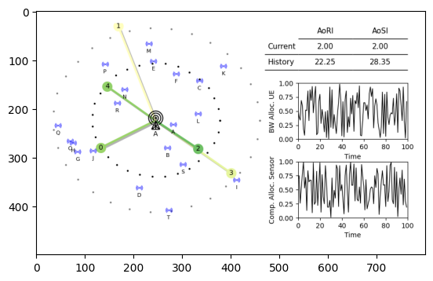

# MetaLore: Learning to Orchestrate the Metaverse


**MetaLore** is a simulation environment for exploring dynamic resource allocation in **smart city** and **metaverse**-applications. It models the interaction between mobile users, sensors, base stations and edge servers in a **sub-metaverse**, where efficient orchestration of limited communication and computational resources is critical for real-time synchronization between the physical and digital worlds.

Built upon the [`mobile-env`](https://github.com/stefanbschneider/mobile-env) framework, MetaLore extends its capabilities to support **deep reinforcement learning (DRL)**-based control and **Age of Information (AoI)**-aware optimization.


## Overview

In a smart city, mobile User Equipments (UEs) generate tasks that must be offloaded to a nearby MEC server (hosted at a Base Station) for processing. At the same time, IoT sensors continuously collect environmental data used to maintain a live **digital twin** of the physical world. Before a UE's job can be processed, the MEC server must have the relevant, up-to-date sensor data.

MetaLore simulates this system end-to-end:

- UEs and sensors generate jobs, which are transmitted wirelessly to a BS.
- The BS processes jobs using its MEC compute capacity.
- UE jobs are only processed once the corresponding sensor data has arrived (synchronized processing).
- An RL agent controls how bandwidth and compute resources are split between UEs and sensors at every timestep.
- The reward function penalizes latency and rewards fresh, synchronized data delivery.

<center>
  
</center>

### Key Research Concepts

MetaLore was developed as part of an ongoing PhD research project focused on real-time synchronization and resource allocation in smart city environments. Using reinforcement learning, the system learns to adaptively manage heterogeneous traffic demands and maintain digital twin synchronization in dynamic network conditions.


| Concept | Description |
|---|---|
| **Age of Request Information (AoRI)** | End-to-end latency: from job generation at the UE to completion at the MEC server |
| **Age of Sensor Information (AoSI)** | Staleness of sensor data relative to the time a UE job was generated |
| **Digital twin synchronization** | Sensors maintain a real-time model of the physical environment for UE job context |
| **Multi-Objective Optimization** | Balances throughput, latency and synchronization accuracy through a DRL reward function |
| **DRL Integration** | Fully compatible with Gymnasium and Stable-Baselines3, with native support for Proximal Policy Optimization (PPO) |
| **Visualizations & Evaluation Tools** | Built-in tools for monitoring queue dynamics, AoI metrics and policy performance |


## Installation

**Prerequisites:** Python 3.9+ and pip must be installed on your system. If you don't have Python, download it from [python.org](https://www.python.org/downloads/) or install it via your package manager (e.g. `brew install python` on macOS, `apt install python3` on Ubuntu).

```bash
git clone https://github.com/elifohri/MetaLore-simulator
cd MetaLore
pip install -e .
```

**Dependencies:** `gymnasium`, `numpy`, `pandas`, `matplotlib`, `pygame`, `shapely`, `svgpath2mpl`

> To run the example notebooks, also install Jupyter: `pip install jupyter`


## Quick Start

### Using a pre-registered environment

```python
import gymnasium
import metalore  # triggers environment registration

env = gymnasium.make("metalore-single_cell-smart_city-default-v0")
obs, info = env.reset()

for _ in range(100):
    action = env.action_space.sample()   # random agent
    obs, reward, terminated, truncated, info = env.step(action)
    if terminated or truncated:
        obs, info = env.reset()

env.close()
```

### Using a custom configuration

```python
from metalore.scenarios.single_cell import SingleCellEnv
from metalore.config import default_config, merge_config

config = default_config()
config = merge_config(config, {
    "environment": {
        "num_ues": 10,
        "num_sensors": 5,
        "max_steps": 200,
    },
    "bs": {
        "bandwidth": 200e6,         # 200 MHz
        "compute_capacity": 2e9,    # 2 GHz
    },
    "reward": {
        "e2e_delay_threshold": 3.0,
    },
})

env = SingleCellEnv(config=config)
obs, info = env.reset()
```


## Pre-configured Environments

| Environment ID | BSs | UEs | Sensors | Description |
|---|---|---|---|---|
| `metalore-single_cell-smart_city-default-v0` | 1 | 3 | 3 | Default small scenario |
| `metalore-single_cell-smart_city-small-v0` | 1 | 5 | 8 | Small-scale scenario |
| `metalore-single_cell-smart_city-large-v0` | 1 | 20 | 10 | Large-scale scenario |
| `metalore-multi_cell-smart_city-default-v0` | 3 | 15 | 20 | Multi-cell scenario |


## Contributing

### Development Team: 
- [@elifohri](https://github.com/elifohri)

We welcome any contributions to the MetaLore Simulator. It can be adding new features, refining existing functionalities, resolving bugs or improving documentation.

### Citation:

If you use `MetaLore` simulator in your work, please cite our paper: [paper in PDF](https://arxiv.org/abs/2510.25705)

```
@misc{ohri2025metalorelearningorchestratecommunication,
      title={MetaLore: Learning to Orchestrate Communication and Computation for Metaverse Synchronization}, 
      author={Elif Ebru Ohri and Qi Liao and Anastasios Giovanidis and Francesca Fossati and Nour-El-Houda Yellas},
      year={2025},
      eprint={2510.25705},
      archivePrefix={arXiv},
      primaryClass={cs.NI},
      url={https://arxiv.org/abs/2510.25705}, 
}
```


### How to contribute:

**1. Fork the Repository:** Start by creating a fork of this repository to your GitHub account.

**2. Create a Feature Branch:** Work on your changes in a dedicated feature branch to keep development organized.

**3. Submit a Pull Request (PR):** Once your changes are ready, submit a PR describing the enhancement, fix or addition.

We value well-documented and tested contributions that align with the project's goals and coding standards.

### Feature Your Project

If you use MetaLore Simulator in your research, please let us know and we will feature your project. For any questions, feedback or ideas feel free to open an issue.


## Acknowledgements

MetaLore is a collaborative project between the LIP6 lab at Sorbonne University and Nokia Germany.

This project was developed using the `mobile-env` codebase. We extend our gratitude to the `mobile-env` team for their foundational work in mobile network simulation, which served as an important starting point for this project.
If you'd like to reference the original work, please see their [paper in PDF](https://ris.uni-paderborn.de/download/30236/30237/author_version.pdf).

For more information on mobile-env, visit their [GitHub repository](https://github.com/stefanbschneider/mobile-env).

For questions or further information, please feel free to contact elif-ebru.ohri@lip6.fr or open an issue on this repository.

## License

This project is licensed under the [MIT License](LICENSE).

## References
* S. Schneider, S. Werner, R. Khalili, A. Hecker, and H. Karl, “mobile-env: An open platform for reinforcement learning in wireless mobile networks,” in Network Operations and Management Symposium (NOMS). IEEE/IFIP, 2022.
